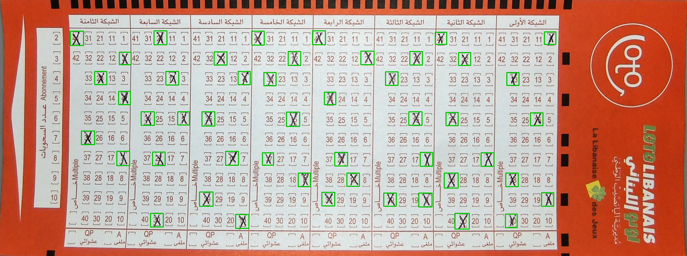

# Lottery Ticket Cross Detector

Detection of hand-drawn cross marks on **Loto Libanais** lottery card scans using a YOLOv8n model trained entirely on synthetic data.

| | |
|---|---|
| **Model** | YOLOv8n (6.3M params) |
| **Task** | Single-class object detection (`cross`) |
| **Training data** | 85,000 synthetic images |
| **Val precision** | 1.000 |
| **Val recall** | 0.955 |
| **CPU inference** | ~20 ms / image |

---

## Sample Output



*48 crosses detected on a real lottery card scan. Green boxes are model predictions.*

---

## Repository Structure

```
.
├── cross_generator.py         # Core synthetic data engine (grid geometry, cross rendering)
├── generate_dataset.py        # Multiprocessing dataset builder — 85K JPEG images + augmentation
├── train.py                   # YOLOv8n training script (4-GPU DDP, float32, MLflow logging)
├── evaluate.py                # Test-split evaluation + P-R curve threshold sweep
├── infer.py                   # Inference CLI — single image or directory, with timing
├── mlflow_logger.py           # MLflow callback for per-epoch metric logging
├── requirements.txt
├── image.png                  # Blank Loto Libanais card scan (1920×721 base image)
├── image_marked.png           # Reference scan with human-drawn marks
└── image_marked_detected.png  # Model output on image_marked.png
```

---

## How It Works

### 1. Synthetic Data Generation

A blank card scan is used as the base. `cross_generator.py` renders randomised, handwriting-style cross marks using NumPy/Pillow and outputs YOLO-format bounding-box annotations. No real labelled data is required.

**Card grid geometry (1920×721 px):**
- 8 networks × 5 sub-columns × 10 rows = 400 valid cell positions
- Network X-starts: `[198, 360, 528, 699, 869, 1040, 1212, 1380]`
- Sub-column offsets per network: `[17, 50, 83, 116, 149]`

**Four cross styles (all class 0 — `cross`):**

| Style | Description |
|-------|-------------|
| `X` | Regular diagonal X with slight tilt jitter |
| `thick_X` | Heavy double-stroke X |
| `+` | Plus mark with tilt jitter |
| `double_X` | Two overlapping X marks at a slight offset |

**12 ink colours** — dark blue, dark red, near-black, blue-black, bright blue, red, pencil grey, green, purple, black, brown, navy.

---

### 2. Dataset — 85,000 Images

| Split | Count | Augmentation |
|-------|-------|-------------|
| Train | 59,500 | Heavy (16 transforms) |
| Val   | 17,000 | Medium |
| Test  | 8,500  | None — clean synthetic |

Built with 40-worker multiprocessing in ~60 minutes.

**Training augmentation pipeline** (Albumentations 2.x) — simulates real lottery-shop camera conditions:

```
Perspective · Affine · GridDistortion
Blur / MotionBlur / GaussianBlur · GaussNoise · ISONoise
Downscale · ImageCompression (JPEG 30–85%)
RandomBrightnessContrast · RandomGamma · CLAHE
HueSaturationValue · RandomShadow · RandomFog
RGBShift · ToGray
```

**Generate the dataset yourself:**

```bash
python generate_dataset.py --output dataset/ --total 85000
```

---

### 3. Training

YOLOv8n trained on 4× Tesla T4 GPUs (AWS `g4dn.12xlarge`) with full float32 precision.

```bash
python train.py \
  --data   dataset/dataset.yaml \
  --model  yolov8n.pt \
  --epochs 150 \
  --batch  128 \
  --device 0,1,2,3 \
  --name   lottery_cross_v1
```

**Key hyperparameters:**

| Param | Value |
|-------|-------|
| Optimizer | AdamW |
| LR (initial / final) | 0.001 / 0.00001 |
| Warmup epochs | 5 |
| Early stopping patience | 30 |
| AMP | Disabled (float32) |
| Mosaic / Mixup | 1.0 / 0.1 |
| Batch (4 GPUs) | 128 (32 per GPU) |

---

### 4. Results

| Split | Precision | Recall | mAP@50 | mAP@50-95 |
|-------|-----------|--------|--------|-----------|
| Val   | **1.000** | 0.955  | 0.955  | 0.804     |
| Test  | **1.000** | 0.955  | 0.955  | 0.803     |

Zero false positives at any confidence threshold. The 4.5% recall gap is stable across IoU thresholds 0.3–0.6, indicating a small fraction of hard cases (very small marks) rather than an NMS suppression issue.

---

### 5. Inference

**CLI:**

```bash
# Single image — prints detection count and latency
python infer.py --model best.pt --source image_marked.png --conf 0.25

# Directory — saves annotated images to predictions/
python infer.py --model best.pt --source dataset/images/test/ --output predictions/

# GPU inference
python infer.py --model best.pt --source image_marked.png --device 0
```

**Python API:**

```python
from ultralytics import YOLO

model = YOLO("best.pt")
results = model.predict("image_marked.png", conf=0.25)
boxes = results[0].boxes.xyxy   # tensor (N, 4) — x1 y1 x2 y2
confs = results[0].boxes.conf   # tensor (N,)
```

**Latency benchmarks (CPU, YOLOv8n, imgsz=640):**

| p50 | p95 | p99 | Mean |
|-----|-----|-----|------|
| 19.9 ms | 21.3 ms | 21.6 ms | 19.7 ms |

---

### 6. Experiment Tracking

All training runs are tracked with a local MLflow server. Logged per run: all hyperparameters, augmentation config, per-epoch losses and val metrics, test-split results, sample images, inference timing, and git commit hash.

```bash
# Start the MLflow UI
bash /path/to/mlflow-server/start_mlflow.sh
open http://localhost:5001
```

---

## Requirements

```bash
pip install -r requirements.txt
```

Core dependencies: `ultralytics`, `albumentations>=2.0`, `opencv-python-headless`, `numpy`, `Pillow`, `tqdm`.  
Optional: `mlflow-skinny` for experiment tracking.

---

## Quick Start

```bash
git clone https://github.com/jde-axelera/lottery-ticket-cross-model
cd lottery-ticket-cross-model
pip install -r requirements.txt

# Run inference on the included sample image
python infer.py --model yolov8n.pt --source image_marked.png

# Generate a small dataset and train
python generate_dataset.py --output dataset/ --total 5000
python train.py --data dataset/dataset.yaml --epochs 50 --batch 32 --device cpu
```
